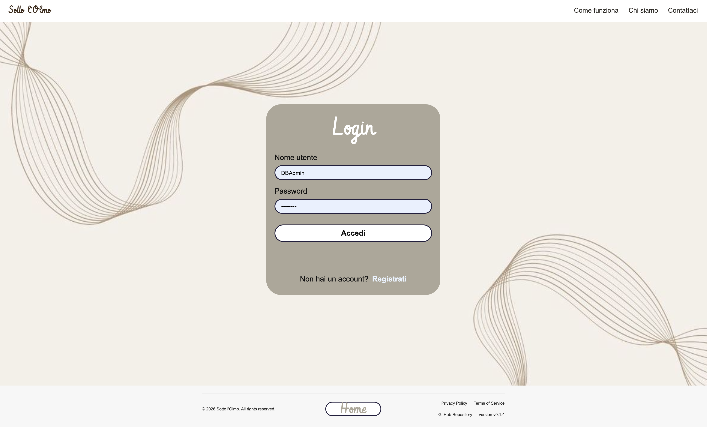
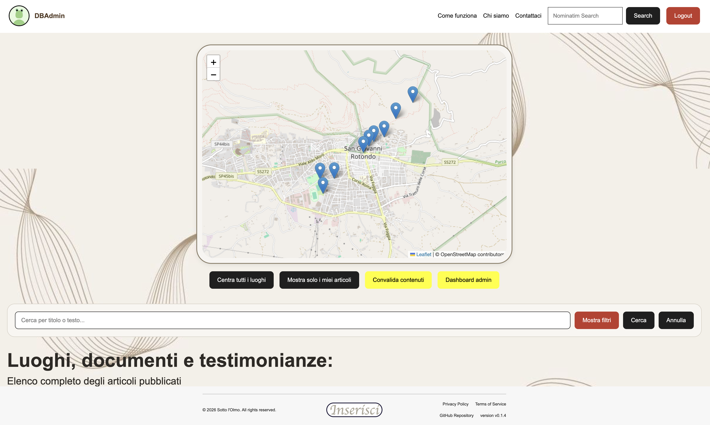
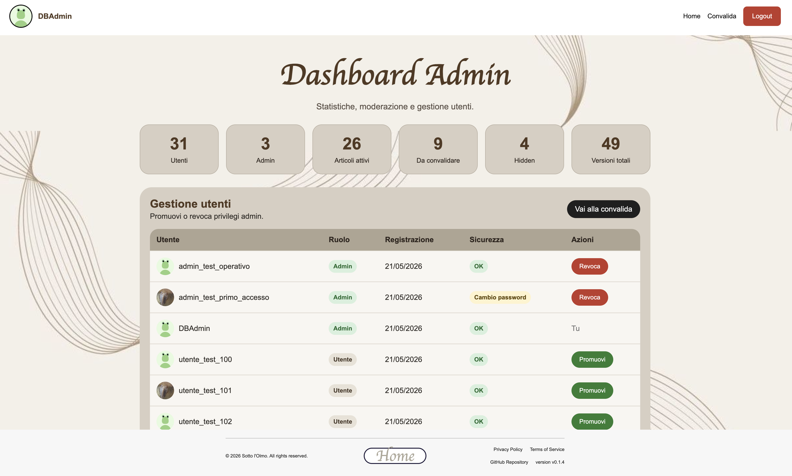

# 🌳 Sotto L'Olmo

Applicazione web PHP/MySQL per raccogliere, proporre, convalidare e consultare contenuti legati alla memoria storica e culturale di un territorio.

## ⚙️ Requisiti

- PHP 7.4 o superiore
- MySQL o MariaDB
- Server web, ad esempio XAMPP

## 🛠️ Installazione

1. Copiare il progetto nella directory servita dal web server.
2. Configurare le credenziali database in:

```text
src/config/config.test.php
```

oppure in:

```text
src/config/config.prod.php
```

se si vuole usare la configurazione di produzione.

3. Aprire dal browser:

```text
scripts/index.html
```

4. Premere `Inizializza`.

Lo script importa sempre:

```text
db/db_schema.sql
```

Se viene selezionato il checkbox dedicato, importa anche i record di test presenti in:

```text
test/db/
```

## 📁 Directory Uploads

L'applicazione usa queste cartelle:

```text
uploads/pfp
uploads/banner
uploads/file
```

In sviluppo locale con XAMPP, se Apache non riesce a scrivere nella cartella, si possono assegnare permessi massimi:

```bash
chmod -R 777 uploads
```

## 🧪 Dati Di Test

La cartella:

```text
test/db/
```

contiene record SQL di esempio.

La cartella:

```text
test/uploads/
```

contiene i file fisici collegati ai record di test.

Per usare i file di test nell'applicazione, copiare o spostare `test/uploads` nella root del progetto come `uploads`.

## ✨ Funzionalità Principali

- registrazione e login;
- profilo utente e modifica password;
- gestione admin;
- inserimento articoli;
- banner, allegati e link;
- coordinate manuali o tramite mappa Leaflet;
- Home con mappa, filtri e paginazione;
- dettaglio articolo con versioni, file, link, coordinate e meteo;
- convalida, rifiuto, hide e restore dei contenuti;
- dashboard admin con statistiche e gestione ruoli.
- modifica articoli tramite nuove versioni da convalidare.

## 🖼️ Anteprima Interfaccia

Gli screenshot principali del software sono raccolti nella cartella `ui/`.

### Landing Page


### Login



### Home E Lista Articoli


### Mappa



### Dashboard Admin



## 🔐 Account Iniziale

Lo schema crea l'admin iniziale:

```text
username: DBAdmin
password: 123!OlmoOlmo!321
```

Al primo accesso viene richiesto il cambio password.
