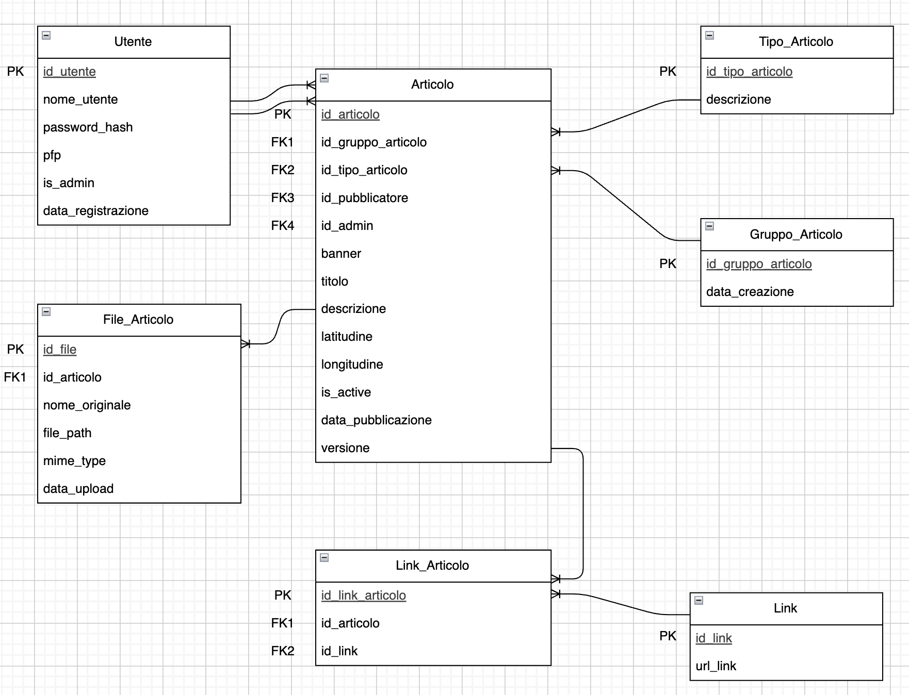

**DOCUMENTAZIONE DEL DB**

**Gruppo:**

Gallo, Scaramuzzi G, Turano e Gagliardi

**Tools:**

Modello concettuale: draw.io

Modello logico: Word

Modello fisico: Visual Studio Code

**Documentazione verbale:**

**Utenti**  
Contiene gli utenti registrati al sistema, distinguendo tra utenti normali e admin.

**Tipi_Articoli**  
Elenca le categorie degli articoli (luogo, documento, testimonianza).

**Gruppi_Articoli**  
Rappresenta l’identità logica di un articolo e serve a raggrupparne le diverse versioni.

**Articoli**  
Contiene i contenuti inseriti dagli utenti, con tutte le informazioni principali e le varie versioni (versioning e storico)

**File_Articoli**  
Gestisce i file caricati (PDF, immagini, etc.) associati agli articoli.

**Link**  
Memorizza i collegamenti esterni utili come fonti o approfondimenti.

**Link_Articoli**  
Tabella di collegamento che associa uno o più link a ciascun articolo.

**  
**

**MODELLO CONCETTUALE**

**  
**

**MODELLO LOGICO**

<u>Ipotesi aggiuntive:</u>

Di default sono tutti NOT NULL

INT equivale a INT(11)

BOOLEAN necessariamente IN (0,1)

IDX abbreviazione di INDEX

UTENTE

<table style="width:100%;">
<colgroup>
<col style="width: 20%" />
<col style="width: 19%" />
<col style="width: 18%" />
<col style="width: 21%" />
<col style="width: 19%" />
</colgroup>
<thead>
<tr class="header">
<th>Campo</th>
<th>Tipo</th>
<th>Chiavi</th>
<th>Vincoli</th>
<th>Spiegazioni</th>
</tr>
</thead>
<tbody>
<tr class="odd">
<td>id_utente</td>
<td>INT</td>
<td>PK</td>
<td>A.I.</td>
<td></td>
</tr>
<tr class="even">
<td>nome_utente</td>
<td>VARCHAR(50)</td>
<td></td>
<td>
UNIQUE

LENGTH(nu) &gt; 3
</td>
<td></td>
</tr>
<tr class="odd">
<td>password_hash</td>
<td>VARCHAR(255)</td>
<td></td>
<td></td>
<td>Hash bcrypt</td>
</tr>
<tr class="even">
<td>pfp</td>
<td>VARCHAR(255)</td>
<td></td>
<td>NULL</td>
<td>Percorso sul server della foto profilo</td>
</tr>
<tr class="odd">
<td>data_registrazione</td>
<td>DATE</td>
<td></td>
<td>DEFAULT CURRENT_DATE</td>
<td></td>
</tr>
<tr class="even">
<td>is_admin</td>
<td>BOOLEAN</td>
<td></td>
<td>DEFAULT 0</td>
<td>La registrazione permette di creare solo utenti normali. L’aggiunta di admin sarà a carico del DBA o altri admin tramite una pagina dedicata.”</td>
</tr>
</tbody>
</table>

TIPO_ARTICOLO

| Campo            | Tipo        | Chiavi | Vincoli | Spiegazioni                                          |
|------------------|-------------|--------|---------|------------------------------------------------------|
| id_tipo_articolo | INT         | PK     | A.I.    |                                                      |
| descrizione      | VARCHAR(20) |        | UNIQUE  | Già creati nel DB (luogo, documento e testimonianza) |

GRUPPO_ARTICOLO

| Campo              | Tipo | Chiavi | Vincoli              | Spiegazioni |
|--------------------|------|--------|----------------------|-------------|
| id_gruppo_articolo | INT  | PK     | A.I.                 |             |
| data_creazione     | DATE |        | DEFAULT CURRENT_DATE |             |

ARTICOLO

<table>
<colgroup>
<col style="width: 21%" />
<col style="width: 19%" />
<col style="width: 14%" />
<col style="width: 26%" />
<col style="width: 18%" />
</colgroup>
<thead>
<tr class="header">
<th>Campo</th>
<th>Tipo</th>
<th>Chiavi</th>
<th>Vincoli</th>
<th>Spiegazioni</th>
</tr>
</thead>
<tbody>
<tr class="odd">
<td>id_articolo</td>
<td>INT</td>
<td>PK</td>
<td>A.I.</td>
<td></td>
</tr>
<tr class="even">
<td>id_gruppo_articolo</td>
<td>INT</td>
<td>FK1, IDX1</td>
<td>
UNIQUE con versione

UPDATE – CASCADE

DELETE – RESTRICT
</td>
<td>Raggruppa tutte le eventuali versioni di un articolo</td>
</tr>
<tr class="odd">
<td>id_tipo_articolo</td>
<td>INT</td>
<td>FK2, IDX2</td>
<td>
UPDATE – CASCADE

DELETE – RESTRICT
</td>
<td></td>
</tr>
<tr class="even">
<td>id_pubblicatore</td>
<td>INT</td>
<td>FK3, IDX3</td>
<td>
UPDATE – CASCADE

DELETE – RESTRICT
</td>
<td>Utente che ha pubblicato l’articolo (normale o admin)</td>
</tr>
<tr class="odd">
<td>id_admin</td>
<td>INT</td>
<td>FK4, IDX4</td>
<td>
NULL

UPDATE – CASCADE

DELETE – SET NULL
</td>
<td>Utente admin che ha approvato l’articolo</td>
</tr>
<tr class="even">
<td>banner</td>
<td>VARCHAR(255)</td>
<td></td>
<td></td>
<td>Percorso sul server del banner</td>
</tr>
<tr class="odd">
<td>titolo</td>
<td>VARCHAR(100)</td>
<td></td>
<td></td>
<td>Deve essere unico tra gli articoli di gruppo diverso (vincolo non gestito dal DB)</td>
</tr>
<tr class="even">
<td>descrizione</td>
<td>TEXT</td>
<td></td>
<td></td>
<td></td>
</tr>
<tr class="odd">
<td>latitudine</td>
<td>DECIMAL(9,6)</td>
<td></td>
<td>BETWEEN -90 AND 90</td>
<td></td>
</tr>
<tr class="even">
<td>longitudine</td>
<td>DECIMAL(9,6)</td>
<td></td>
<td>BETWEEN -180 AND 180</td>
<td></td>
</tr>
<tr class="odd">
<td>versione</td>
<td>INT</td>
<td></td>
<td>
UNIQUE con id_gruppo_articolo

DEFAULT 1

&gt;= 1
</td>
<td>Utilizzato per il versioning/storico degli articoli</td>
</tr>
<tr class="even">
<td>data_pubblicazione</td>
<td>DATE</td>
<td>IDX5</td>
<td>DEFAULT CURRENT_DATE</td>
<td></td>
</tr>
<tr class="odd">
<td>is_active</td>
<td>BOOLEAN</td>
<td>IDX6</td>
<td>DEFAULT 0</td>
<td>Solo un articolo per gruppo può essere attivo alla volta (vincolo non gestito dal DB)</td>
</tr>
</tbody>
</table>

FILE_ARTICOLI

<table>
<colgroup>
<col style="width: 19%" />
<col style="width: 19%" />
<col style="width: 19%" />
<col style="width: 21%" />
<col style="width: 19%" />
</colgroup>
<thead>
<tr class="header">
<th>Campo</th>
<th>Tipo</th>
<th>Chiavi</th>
<th>Vincoli</th>
<th>Spiegazioni</th>
</tr>
</thead>
<tbody>
<tr class="odd">
<td>id_file</td>
<td>INT</td>
<td>PK</td>
<td>A.I.</td>
<td></td>
</tr>
<tr class="even">
<td>id_articolo</td>
<td>INT</td>
<td>FK, IDX</td>
<td></td>
<td></td>
</tr>
<tr class="odd">
<td>nome_originale</td>
<td>VARCHAR(255)</td>
<td></td>
<td></td>
<td></td>
</tr>
<tr class="even">
<td>file_path</td>
<td>VARCHAR(255)</td>
<td></td>
<td></td>
<td>Percorso sul server del file</td>
</tr>
<tr class="odd">
<td>mime_type</td>
<td>VARCHAR(100)</td>
<td></td>
<td></td>
<td>
Tipo del file secondo lo standard di IANA

(e.g. image/png)
</td>
</tr>
<tr class="even">
<td>data_upload</td>
<td>DATE</td>
<td></td>
<td>DEFAULT CURRENT_DATE</td>
<td></td>
</tr>
</tbody>
</table>

LINK

| Campo    | Tipo         | Chiavi | Vincoli | Spiegazioni                                        |
|----------|--------------|--------|---------|----------------------------------------------------|
| id_link  | INT          | PK     | A.I.    |                                                    |
| url_link | VARCHAR(255) |        | UNIQUE  | URL di approfondimento (preferibilmente wikipedia) |

LINK_ARTICOLO

| Campo            | Tipo | Chiavi    | Vincoli | Spiegazioni |
|------------------|------|-----------|---------|-------------|
| id_link_articolo | INT  | PK        | A.I.    |             |
| id_articolo      | INT  | FK1, IDX1 |         |             |
| id_link          | INT  | FK2, IDX2 |         |             |

**MODELLO FISICO**

-- Parte DDL

CREATE DATABASE Olmo;

USE Olmo;

CREATE TABLE utenti(

id_utente INT NOT NULL AUTO_INCREMENT,

nome_utente VARCHAR(50) NOT NULL UNIQUE,

password_hash VARCHAR(255) NOT NULL,

pfp VARCHAR(255),

data_registrazione DATE NOT NULL DEFAULT CURRENT_DATE,

is_admin BOOLEAN NOT NULL DEFAULT 0,

CONSTRAINT PK_utenti PRIMARY KEY(id_utente),

CONSTRAINT CK_utenti_is_admin CHECK(is_admin IN (0,1))

);

CREATE TABLE tipi_articoli(

id_tipo_articolo INT NOT NULL AUTO_INCREMENT,

descrizione VARCHAR(20) NOT NULL UNIQUE,

CONSTRAINT PK_tipi_articoli PRIMARY KEY(id_tipo_articolo)

);

CREATE TABLE gruppi_articoli(

id_gruppo_articolo INT NOT NULL AUTO_INCREMENT,

data_creazione DATE NOT NULL DEFAULT CURRENT_DATE,

CONSTRAINT PK_gruppi_articoli PRIMARY KEY(id_gruppo_articolo)

);

CREATE TABLE articoli(

id_articolo INT NOT NULL AUTO_INCREMENT,

id_gruppo_articolo INT NOT NULL,

id_tipo_articolo INT NOT NULL,

id_pubblicatore INT NOT NULL,

id_admin INT NULL,

banner VARCHAR(255) NULL,

titolo VARCHAR(100) NOT NULL,

descrizione TEXT NOT NULL,

latitudine DECIMAL(9,6) NULL,

longitudine DECIMAL(9,6) NULL,

data_pubblicazione DATE NOT NULL DEFAULT CURRENT_DATE,

versione INT NOT NULL DEFAULT 1,

is_active BOOLEAN NOT NULL DEFAULT 0,

CONSTRAINT PK_articoli PRIMARY KEY(id_articolo),

CONSTRAINT FK1_articoli_gruppo FOREIGN KEY(id_gruppo_articolo)

REFERENCES gruppi_articoli(id_gruppo_articolo)

ON UPDATE CASCADE

ON DELETE RESTRICT,

CONSTRAINT FK2_articoli_tipi FOREIGN KEY(id_tipo_articolo)

REFERENCES tipi_articoli(id_tipo_articolo)

ON UPDATE CASCADE

ON DELETE RESTRICT,

CONSTRAINT FK3_articoli_utenti FOREIGN KEY(id_pubblicatore)

REFERENCES utenti(id_utente)

ON UPDATE CASCADE

ON DELETE RESTRICT,

CONSTRAINT FK4_articoli_admin FOREIGN KEY(id_admin)

REFERENCES utenti(id_utente)

ON UPDATE CASCADE

ON DELETE SET NULL,

CONSTRAINT CK_articoli_is_active CHECK(is_active IN (0,1)),

CONSTRAINT CK_articoli_latitudine CHECK(latitudine IS NULL OR latitudine BETWEEN -90 AND 90),

CONSTRAINT CK_articoli_longitudine CHECK(longitudine IS NULL OR longitudine BETWEEN -180 AND 180),

CONSTRAINT CK_articoli_versione CHECK(versione \>= 1),

CONSTRAINT UQ_articoli_gruppo_versione UNIQUE(id_gruppo_articolo, versione)

);

CREATE INDEX idx_articoli_tipo ON articoli(id_tipo_articolo);

CREATE INDEX idx_articoli_pubblicatore ON articoli(id_pubblicatore);

CREATE INDEX idx_articoli_admin ON articoli(id_admin);

CREATE INDEX idx_articoli_data_pubblicazione ON articoli(data_pubblicazione);

CREATE INDEX idx_articoli_attivi ON articoli(is_active);

CREATE TABLE file_articoli(

id_file INT NOT NULL AUTO_INCREMENT,

id_articolo INT NOT NULL,

nome_originale VARCHAR(255) NOT NULL,

file_path VARCHAR(255) NOT NULL,

mime_type VARCHAR(100) NOT NULL,

data_upload DATE NOT NULL DEFAULT CURRENT_DATE,

CONSTRAINT PK_file_articoli PRIMARY KEY(id_file),

CONSTRAINT FK_file_articoli FOREIGN KEY(id_articolo)

REFERENCES articoli(id_articolo)

ON UPDATE CASCADE

ON DELETE CASCADE

);

CREATE INDEX idx_file_articoli_articolo ON file_articoli(id_articolo);

CREATE TABLE link(

id_link INT NOT NULL AUTO_INCREMENT,

url_link VARCHAR(255) NOT NULL UNIQUE,

CONSTRAINT PK_link PRIMARY KEY(id_link)

);

CREATE TABLE link_articoli(

id_link_articolo INT NOT NULL AUTO_INCREMENT,

id_articolo INT NOT NULL,

id_link INT NOT NULL,

CONSTRAINT PK_link_articoli PRIMARY KEY(id_link_articolo),

CONSTRAINT FK1_link_articoli FOREIGN KEY(id_articolo)

REFERENCES articoli(id_articolo)

ON UPDATE CASCADE

ON DELETE CASCADE,

CONSTRAINT FK2_link_link FOREIGN KEY(id_link)

REFERENCES link(id_link)

ON UPDATE CASCADE

ON DELETE CASCADE,

CONSTRAINT UQ_link_articolo UNIQUE(id_articolo, id_link)

);

CREATE INDEX idx_link_articoli_articolo ON link_articoli(id_articolo);

CREATE INDEX idx_link_articoli_link ON link_articoli(id_link);

-- Parte DML

-- Tipi articoli previsti

INSERT INTO tipi_articoli(descrizione)

VALUES

('luogo'),

('documento'),

('testimonianza');

-- Amministratore

INSERT INTO utenti(nome_utente, password_hash, is_admin)

VALUES ("DBAdmin", "\$2y\$12\$MFMnmfE16pJ8b5w30SLBoepi3T4BRhTjhvK.gTEyutNqKr9C/XuVS", 1)
